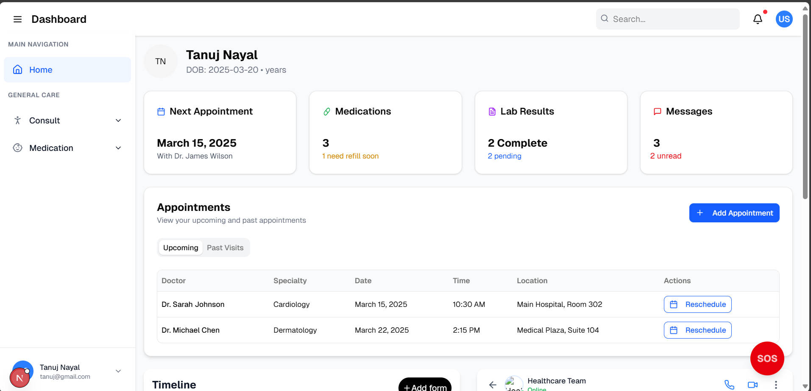

<div align="center">

# 🏥 MedPredict
### *AI-Powered Healthcare Management System*



<p align="center">
  
  
  
  
  
</p>

<p align="center">
  
  
  
</p>

---

### 🌟 **Revolutionizing Healthcare with AI**
*MedPredict is a cutting-edge healthcare management platform that combines artificial intelligence with modern web technologies to provide personalized medical care, intelligent disease prediction, and comprehensive health monitoring.*

<br>

<table>
  <tr>
    <td>
      <a href="#features">
        
      </a>
    </td>
    <td>
      <a href="#installation">
        
      </a>
    </td>
    <td>
      <a href="#tech-stack">
        
      </a>
    </td>
    <td>
      <a href="#contributing">
        
      </a>
    </td>
  </tr>
</table>

</div>


<br>

## ✨ Features

<div align="center">
  
</div>

<table>
  <tr>
    <td width="50%">
      <h3>🧠 AI Disease Prediction</h3>
      <ul>
        <li>🎯 Advanced ML algorithms for early detection</li>
        <li>📊 Personalized risk assessments</li>
        <li>⚡ Real-time health monitoring</li>
        <li>🔮 Predictive analytics for prevention</li>
      </ul>
    </td>
    <td width="50%">
      <h3>💊 Smart Medication Management</h3>
      <ul>
        <li>🤖 Intelligent prescription recommendations</li>
        <li>⚠️ Drug interaction & safety alerts</li>
        <li>⚖️ Dosage optimization</li>
        <li>🔄 Alternative medication suggestions</li>
      </ul>
    </td>
  </tr>
  <tr>
    <td>
      <h3>🏥 Healthcare Dashboard</h3>
      <ul>
        <li>👤 Complete patient profiles</li>
        <li>📈 Vital signs tracking</li>
        <li>📅 Appointment management</li>
        <li>🧪 Lab results timeline</li>
      </ul>
    </td>
    <td>
      <h3>👶 Specialized Care Modules</h3>
      <ul>
        <li>🤱 Pregnancy health monitoring</li>
        <li>👶 Pediatric care guidance</li>
        <li>💬 AI health consultation</li>
        <li>🚨 Emergency SOS features</li>
      </ul>
    </td>
  </tr>
</table>

<div align="center">
  
### 🎨 **Modern User Experience**


</div>

<br>

## 🛠️ Tech Stack

<div align="center">
  
</div>

<table>
  <tr>
    <td align="center" width="33%">
      <h3>🎨 Frontend</h3>
      <br><br>
      <br>
      <br>
      <br>
      
    </td>
    <td align="center" width="33%">
      <h3>🔐 Backend & Auth</h3>
      <br><br>
      <br>
      <br>
      
    </td>
    <td align="center" width="33%">
      <h3>🛠️ Development</h3>
      <br><br>
      <br>
      <br>
      
    </td>
  </tr>
</table>

<div align="center">

### 🏗️ **Architecture Highlights**


</div>

<br>

## 🚀 Installation

<div align="center">
  
</div>

<table>
  <tr>
    <td width="30%">
      <h3>📋 Prerequisites</h3>
      <ul>
        <li>
          
        </li>
        <li>
          
        </li>
        <li>
          
        </li>
      </ul>
    </td>
    <td width="70%">
      <h3>⚡ Quick Start</h3>
      
```bash
# 📥 Clone the repository
git clone https://github.com/your-username/gehu_hackathon.git
cd gehu_hackathon

# 📦 Install dependencies
npm install
# or yarn install / pnpm install / bun install

# 🔧 Setup environment
cp .env.example .env.local

# 🚀 Start development server
npm run dev
```

<div align="center">
  
</div>

    </td>
  </tr>
</table>

### 🔐 Environment Configuration

<details>
<summary><b>Click to expand environment setup</b></summary>

Create a `.env.local` file in the root directory:

```env
# 🌐 API Configuration
NEXT_PUBLIC_API_URL=http://127.0.0.1:8000
NEXT_PUBLIC_APP_NAME=MedPredict

# 🔑 Authentication (if using external services)
# NEXT_PUBLIC_AUTH_DOMAIN=your-auth-domain
# NEXT_PUBLIC_CLIENT_ID=your-client-id
```

</details>

<br>

## 📁 Project Structure

<div align="center">
  
</div>

<table>
  <tr>
    <td width="50%">

```
📦 gehu_hackathon/
├── 🌐 public/                     # Static assets
│   ├── 📊 dashboard.webp         # Dashboard screenshots
│   ├── 🖼️ finalDash.png          # Main dashboard image
│   └── 🎨 *.svg                  # Icons and logos
│
├── 📂 src/
│   ├── 🏠 app/                   # Next.js App Router
│   │   ├── 🔐 auth/              # Authentication pages
│   │   │   ├── 🚪 login/         # Login page
│   │   │   └── ✍️ sign-up/       # Registration page
│   │   │
│   │   ├── 📊 dashboard/         # Protected dashboard routes
│   │   │   ├── 👶 child/         # Child healthcare module
│   │   │   ├── 💬 general/       # General consultation
│   │   │   ├── 💊 medication/    # Medication management
│   │   │   │   ├── 📝 prescription/  # Prescription AI chat
│   │   │   │   └── 🔄 substitute/    # Medication substitute AI
│   │   │   └── 🤱 pregnancy/     # Pregnancy care module
│   │   │
│   │   ├── 🪝 hooks/             # Custom React hooks
│   │   ├── 🎨 globals.css        # Global styles
│   │   ├── 📄 layout.tsx         # Root layout
│   │   ├── 🏠 page.tsx           # Landing page
│   │   └── ⚙️ provider.tsx       # Context providers
```

    </td>
    <td width="50%">

```
│   ├── 🧩 components/            # Reusable components
│   │   ├── 🛠️ custom/            # Feature-specific components
│   │   │   ├── 📅 Appointment.tsx      # Appointment management
│   │   │   ├── 💬 Consult.tsx          # Consultation interface
│   │   │   ├── 📈 HealthSummery.tsx    # Health metrics display
│   │   │   ├── 🧪 LabResult.tsx        # Lab results timeline
│   │   │   ├── 💌 Message.tsx          # Healthcare messaging
│   │   │   ├── 👤 PatientHealthModel.tsx # Patient profile form
│   │   │   ├── ⚡ QuickAction.tsx      # Quick action buttons
│   │   │   ├── 🚨 SOS.tsx              # Emergency SOS button
│   │   │   └── ⏰ Timeline*.tsx        # Timeline components
│   │   │
│   │   ├── 📝 types/             # TypeScript type definitions
│   │   └── 🎨 ui/                # shadcn/ui components
│   │
│   ├── 🔧 context/               # React Context
│   │   └── 🔐 AuthContext.tsx    # Authentication context
│   │
│   └── 📚 lib/                   # Utility functions
│       └── 🛠️ utils.ts           # Utility helpers
│
├── ⚙️ components.json            # shadcn/ui configuration
├── 🔧 next.config.ts             # Next.js configuration
├── 📦 package.json               # Dependencies and scripts
├── 🎨 tailwind.config.js         # Tailwind CSS configuration
└── 📘 tsconfig.json             # TypeScript configuration
```

    </td>
  </tr>
</table>

<div align="center">

### 🗂️ **Key Directories Explained**


</div>

<br>

## 🎯 Key Features Breakdown

<div align="center">
  
</div>

<table>
  <tr>
    <td align="center">
      <h3>🔐 Authentication System</h3>
      
      <ul align="left">
        <li>🔒 Secure JWT-based authentication</li>
        <li>🔄 Auto token refresh functionality</li>
        <li>🛡️ Protected routes with middleware</li>
        <li>📝 User registration and login</li>
      </ul>
    </td>
    <td align="center">
      <h3>📊 Dashboard Components</h3>
      
      <ul align="left">
        <li>📈 Visual health metrics representation</li>
        <li>📅 Appointment tracking & management</li>
        <li>💊 Medication schedules & refills</li>
        <li>🧪 Lab results timeline view</li>
      </ul>
    </td>
  </tr>
  <tr>
    <td align="center">
      <h3>🤖 AI-Powered Features</h3>
      
      <ul align="left">
        <li>🧠 ML algorithms for health assessment</li>
        <li>💊 AI prescription assistant chatbot</li>
        <li>🔄 Smart medication alternatives</li>
        <li>💬 Specialized healthcare consultation</li>
      </ul>
    </td>
    <td align="center">
      <h3>📱 Responsive Design</h3>
      
      <ul align="left">
        <li>📱 Mobile-first approach</li>
        <li>💻 Desktop & tablet optimized</li>
        <li>👆 Touch-friendly interface</li>
        <li>♿ Accessibility compliance</li>
      </ul>
    </td>
  </tr>
</table>

<br>

## 🚀 Available Scripts

<div align="center">
  
</div>

<table align="center">
  <tr>
    <th>🛠️ Command</th>
    <th>📝 Description</th>
    <th>🔧 Package Manager</th>
  </tr>
  <tr>
    <td><code>npm run dev</code></td>
    <td>🚀 Start development server with Turbopack</td>
    <td rowspan="4">
      <br>
      <br>
      <br>
      
    </td>
  </tr>
  <tr>
    <td><code>npm run build</code></td>
    <td>📦 Build for production</td>
  </tr>
  <tr>
    <td><code>npm run start</code></td>
    <td>▶️ Start production server</td>
  </tr>
  <tr>
    <td><code>npm run lint</code></td>
    <td>🔍 Run ESLint code analysis</td>
  </tr>
</table>

<br>

## 🎨 UI/UX Features

<div align="center">
  
</div>

<div align="center">
  
<table>
  <tr>
    <td align="center" width="25%">
      <h4>🎭 Animations</h4>
      <br>
      <small>Smooth transitions & micro-interactions</small>
    </td>
    <td align="center" width="25%">
      <h4>🎨 Design System</h4>
      <br>
      <small>Professional healthcare UI components</small>
    </td>
    <td align="center" width="25%">
      <h4>📱 Responsive</h4>
      <br>
      <small>Adapts to all screen sizes seamlessly</small>
    </td>
    <td align="center" width="25%">
      <h4>♿ Accessibility</h4>
      <br>
      <small>Inclusive design for all users</small>
    </td>
  </tr>
</table>

**Key Design Elements:**
- 🌙 Dark/Light theme support with seamless switching
- ⚡ Skeleton loaders and progress indicators
- 🎯 Interactive hover effects and animations
- 📊 Data visualization with charts and progress bars

</div>

<br>

## 🤝 Contributing

<div align="center">
  
</div>

<div align="center">

### 🌟 **Join Our Healthcare Innovation Team!**


</div>

<table>
  <tr>
    <td width="50%">
      <h3>🚀 Quick Contribution Guide</h3>
      <ol>
        <li>🍴 <strong>Fork</strong> the repository</li>
        <li>🌿 Create your feature branch<br>
          <code>git checkout -b feature/AmazingFeature</code></li>
        <li>💾 Commit your changes<br>
          <code>git commit -m 'Add: Amazing new feature'</code></li>
        <li>📤 Push to the branch<br>
          <code>git push origin feature/AmazingFeature</code></li>
        <li>🎯 Open a <strong>Pull Request</strong></li>
      </ol>
    </td>
    <td width="50%">
      <h3>📋 Development Guidelines</h3>
      <ul>
        <li>📝 Follow TypeScript best practices</li>
        <li>📖 Maintain component documentation</li>
        <li>✅ Write meaningful commit messages</li>
        <li>📱 Test responsive design on multiple devices</li>
        <li>♿ Ensure accessibility compliance</li>
        <li>🎨 Follow the existing design patterns</li>
      </ul>
    </td>
  </tr>
</table>

<div align="center">

### 💡 **How You Can Help**


<br><br>

**Found a bug?** 🐛 [Create an Issue](https://github.com/your-repo/issues/new?template=bug_report.md)<br>
**Have an idea?** 💡 [Request a Feature](https://github.com/your-repo/issues/new?template=feature_request.md)<br>
**Want to help?** 🤝 [Check Open Issues](https://github.com/your-repo/issues)

</div>

<br>

## 📄 License

<div align="center">
  
</div>

<div align="center">


This project is licensed under the **MIT License** - see the [LICENSE.md](LICENSE.md) file for details.

*Feel free to use, modify, and distribute this code for both personal and commercial projects.*

</div>

<br>

## 👥 Team

<div align="center">
  
</div>

<div align="center">

### 💝 **Built with ❤️ by Team $)$**


*Dedicated to revolutionizing healthcare through technology*

</div>

<br>

## 🙏 Acknowledgments

<div align="center">
  
</div>

<table align="center">
  <tr>
    <td align="center">
      <a href="https://nextjs.org/">
        
        <br><b>Next.js</b>
      </a>
      <br><small>Amazing React framework</small>
    </td>
    <td align="center">
      <a href="https://tailwindcss.com/">
        
        <br><b>Tailwind CSS</b>
      </a>
      <br><small>Utility-first styling</small>
    </td>
    <td align="center">
      <a href="https://ui.shadcn.com/">
        
        <br><b>shadcn/ui</b>
      </a>
      <br><small>Beautiful UI components</small>
    </td>
    <td align="center">
      <a href="https://www.framer.com/motion/">
        
        <br><b>Framer Motion</b>
      </a>
      <br><small>Smooth animations</small>
    </td>
    <td align="center">
      <a href="https://www.radix-ui.com/">
        
        <br><b>Radix UI</b>
      </a>
      <br><small>Accessible primitives</small>
    </td>
  </tr>
</table>

---

<div align="center">


### 🔝 **[⬆ Back to Top](#-medpredict)**

<br>


<br><br>

**🌟 Don't forget to star this repo if you found it helpful! 🌟**

<br>


</div>
